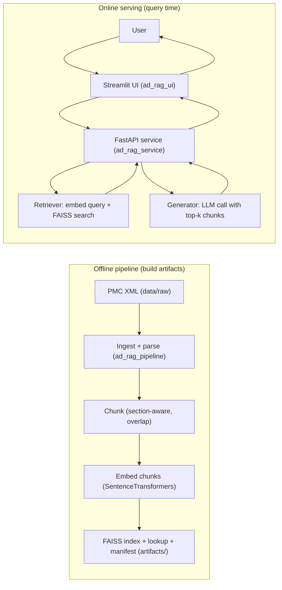

# Alzheimer’s Disease Biomarkers Q&A RAG Microservice

[](https://github.com/rohitpc/ad-rag-app/actions/workflows/ci.yml)

A specialized Retrieval-Augmented Generation (RAG) system for Alzheimer’s Disease biomarkers research. This application ingests scientific literature (PMC XML), builds a searchable index, and provides a question-answering interface grounded in biomedical evidence.

## Features

- **Data Pipeline**: Ingests and chunks PMC XML articles.
- **Vector Search**: Uses FAISS for efficient similarity search with embeddings (Sentence Transformers).
- **RAG Service**: Orchestrates retrieval and generation using OpenAI or Anthropic LLMs.
- **Interactive UI**: A Streamlit-based web interface for querying and exploring citations.
- **Citations**: Provides grounded answers with links to specific source chunks and relevance scores.
- **API**: FastAPI backend with health, metadata, retrieval-only, and full RAG query endpoints.

## Architecture



## Prerequisites

- Python 3.12+
- [uv](https://github.com/astral-sh/uv) (recommended for dependency management)

## Installation

1. **Clone the repository:**
   ```bash
   git clone https://github.com/rohitpc/ad-rag-app.git
   cd ad-rag-app
````

2. **Set up environment variables:**
   Copy the example environment file and configure your API keys (OpenAI or Anthropic).

   ```bash
   cp .env.example .env
   # Edit .env with your keys
   ```

3. **Install dependencies:**

   ```bash
   make sync
   # OR using uv directly:
   uv sync
   ```

## Data Curation and Indexing

The RAG service relies on a pre-built FAISS index and associated lookup tables. These artifacts are generated from raw scientific literature data.

1.  **Fetch Raw Data (PMC XMLs):**
    Use `scripts/fetch_pmc.py` to download PMC XML articles. This populates the `data/raw/` directory.

    ```bash
    uv run python scripts/fetch_pmc.py
    ```

2.  **Build Chunks from Raw Data:**
    Process the raw XMLs into structured chunks using `scripts/build_chunks.py`. This populates `data/processed/chunks/`.

    ```bash
    uv run python scripts/build_chunks.py
    ```

3.  **Build FAISS Index:**
    Create the FAISS index and lookup tables from the processed chunks using `scripts/build_index.py`. This generates artifacts in `artifacts/index/`.

    ```bash
    uv run python scripts/build_index.py
    ```

## Usage

### Artifacts prerequisite

The service/UI require the built index artifacts to exist at the configured paths:

* FAISS index
* lookup table (JSONL)
* manifest (JSON)

If you have not built artifacts yet, run your pipeline scripts to produce them (see `scripts/` and `ad_rag_pipeline/`).

### Running the Web Interface (Streamlit)

Launch the Streamlit app to interact with the RAG service:

```bash
uv run streamlit run src/ad_rag_ui/app.py
```

Open your browser at `http://localhost:8501`.

### Running the API (FastAPI)

Run the backend API (example; adjust module path to your actual API entry file):

```bash
uv run uvicorn src.ad_rag_service.main:app --host 0.0.0.0 --port 8000
```

Open:

* API base: `http://localhost:8000`
* OpenAPI docs: `http://localhost:8000/docs`

## API

### Endpoints

* `GET /health`
  Returns service health and whether the FAISS index is loaded.

* `GET /metadata`
  Returns deployment/debug metadata including artifact presence and the parsed manifest (if present).

* `POST /retrieve`
  Retrieval-only (no LLM). Returns top-k chunks with scores and metadata.

* `POST /query`
  Full RAG: retrieve + LLM generation. Returns an answer with citations.

### Examples

#### Health

```bash
curl -s http://localhost:8000/health | jq
```

#### Metadata

```bash
curl -s http://localhost:8000/metadata | jq
```

#### Retrieve-only

```bash
curl -s http://localhost:8000/retrieve \
  -H 'Content-Type: application/json' \
  -d '{"query":"Which biomarkers are associated with microglial activation in Alzheimer’s disease?", "k": 5}' | jq
```

#### Full RAG query

```bash
curl -s http://localhost:8000/query \
  -H 'Content-Type: application/json' \
  -d '{"question":"What evidence links TREM2 to Alzheimer’s pathology?"}' | jq
```

### Response shapes (high level)

#### `/retrieve` returns `list[RetrievedChunk]`

Each item contains:

* `score`: float similarity score
* `record`: chunk metadata (e.g., doc identifiers, offsets/locations, and chunk text)

Example (illustrative keys; actual keys depend on your `record` schema):

```json
[
  {
    "score": 0.73,
    "record": {
      "pmcid": "PMC1234567",
      "chunk_id": "PMC1234567::sec3::p2",
      "text": "…",
      "title": "…",
      "section": "…"
    }
  }
]
```

#### `/query` returns `AnswerWithCitations`

Example (illustrative keys; actual keys depend on your `AnswerWithCitations` schema):

```json
{
  "answer": "…",
  "citations": [
    {
      "score": 0.73,
      "record": { "pmcid": "PMC1234567", "chunk_id": "…", "text": "…" }
    }
  ]
}
```

## Configuration

The application is configured via environment variables (loaded from `.env`). Key settings include:

* **LLM_PROVIDER**: `openai` or `anthropic`
* **OPENAI_API_KEY** / **ANTHROPIC_API_KEY**: credentials for the chosen provider
* **EMBEDDING_MODEL_ID**: HuggingFace model ID for embeddings (default: `BAAI/bge-base-en-v1.5`)
* **LLM_MODEL_NAME**: specific model version (e.g., `gpt-5.1` or `claude-sonnet-4-5`)
* **LLM_TEMPERATURE**: randomness (default: `0.3`)
* **LLM_MAX_TOKENS**: max generation tokens (default: `500`)
* **REASONING_EFFORT**: (e.g., `none`, `low`, `medium`, `high`) influences reasoning (default: `none`)
* **TOP_K**: number of chunks to retrieve (default: `3`)

See `src/ad_rag_service/config.py` for all available configuration options.

## Development Commands

The project includes a `Makefile` for common tasks:

* **Run Tests**:

  ```bash
  make test
  ```
* **Lint Code**:

  ```bash
  make lint
  ```
* **Format Code**:

  ```bash
  make fmt
  ```

## Project Structure

```text
.
├── .github/workflows/   # CI/CD configurations
├── artifacts/           # Generated FAISS indexes and lookup tables
├── data/                # Raw XML data and processed chunks
├── docs/                # Documentation and plans
├── scripts/             # Utility scripts (ingestion, integration testing)
├── src/
│   ├── ad_rag_pipeline/ # Logic for data ingestion, chunking, and indexing
│   ├── ad_rag_service/  # Core RAG service (Retrieval, Generation, LLM adapters, API)
│   └── ad_rag_ui/       # Streamlit web application
├── tests/               # Unit and integration tests
├── .env.example         # Template for environment variables
├── Makefile             # Command shortcuts
├── pyproject.toml       # Project configuration and dependencies
└── README.md            # Project documentation
```

```
::contentReference[oaicite:0]{index=0}
```
